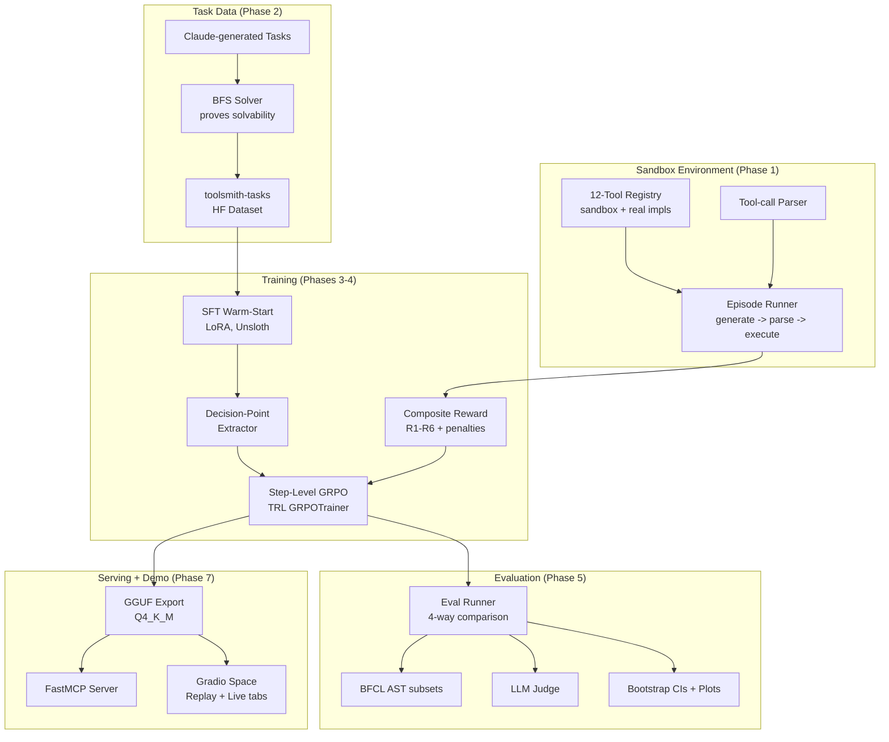

# ToolSmith

**Post-trained small-LLM tool-calling agent.** Qwen3-4B-Instruct-2507 + LoRA SFT warm-start +
step-level GRPO with verifiable, sandbox-computed rewards — no gold trajectories or human
labels needed at the RL stage. Evaluated against a deterministic 12-tool travel-ops sandbox,
against GPT-4o-mini, and against BFCL.

<!-- Demo GIF placeholder: record via scripts/record_demo_gif.sh once the Space is live,
     then replace this line with:  -->
> 🎬 **Demo GIF coming soon** — Space link + Colab live-demo badge below in the meantime.

[](https://huggingface.co/spaces/rohanjain2312/toolsmith-demo)
[](https://huggingface.co/rohanjain2312/toolsmith-qwen3-4b)
[](https://huggingface.co/datasets/rohanjain2312/toolsmith-tasks)

## Results

4-way comparison on held-out test tasks, greedy decoding, identical system prompt/tool schemas,
bootstrap 95% CIs. *(placeholders below — filled in after training + eval, Phases 3-5 human-run
on Colab; see `results/` once populated.)*

| Model | JSON valid % | Correct tool % | Arg accuracy % | Task completion % | Cost / 1k calls |
|---|---|---|---|---|---|
| Qwen3-4B base | {BASE_JSON_VALID} | {BASE_CORRECT_TOOL} | {BASE_ARG_ACC} | {BASE_COMPLETION} | ~$0 (self-host) |
| + SFT | {SFT_JSON_VALID} | {SFT_CORRECT_TOOL} | {SFT_ARG_ACC} | {SFT_COMPLETION} | ~$0 (self-host) |
| + SFT + GRPO | {GRPO_JSON_VALID} | {GRPO_CORRECT_TOOL} | {GRPO_ARG_ACC} | {GRPO_COMPLETION} | ~$0 (self-host) |
| GPT-4o-mini | {GPT4OMINI_JSON_VALID} | {GPT4OMINI_CORRECT_TOOL} | {GPT4OMINI_ARG_ACC} | {GPT4OMINI_COMPLETION} | {GPT4OMINI_COST} |

BFCL (AST subsets: simple / multiple / parallel): {BFCL_BASE} → {BFCL_SFT} → {BFCL_GRPO}.
Full detail in [`MODEL_CARD_TEMPLATE.md`](MODEL_CARD_TEMPLATE.md).

## Architecture



(Mermaid source: [`docs/architecture.mmd`](docs/architecture.mmd).)

## Quickstart

```bash
# from PyPI once published, or from source today:
pip install git+https://github.com/Rohanjain2312/toolsmith.git

# run one task through the sandbox episode runner
toolsmith run --task path/to/task.json --mode sandbox

# serve as a local MCP server (stdio transport)
toolsmith serve --mcp
```

### MCP client config (Claude Desktop)

```json
{
  "mcpServers": {
    "toolsmith": {
      "command": "toolsmith",
      "args": ["serve", "--mcp"]
    }
  }
}
```

Exposes one tool, `run_toolsmith_task(prompt)`, which runs a travel-ops request through the
agent and returns its trajectory summary (tool calls + final answer). The public HF Space also
runs as an MCP server (`mcp_server=True`) — see [`space/README.md`](space/README.md).

## Try it

- **Replay tab** (instant): curated SFT-vs-GRPO trajectory comparisons on the
  [HF Space](https://huggingface.co/spaces/rohanjain2312/toolsmith-demo).
- **Live tab**: run a real task on the Space's free CPU (~2-4 tok/s — GGUF Q4_K_M via
  llama.cpp). For full speed, use the Colab live-demo notebook
  (`notebooks/src/04_live_demo.py`, vLLM on a free T4).

## Honest Limitations

- **A domain-tuned 4B model beating a generalist on its own sandbox is the expected outcome,
  not evidence of general capability.** BFCL (out-of-domain, AST subsets only — live-API
  categories are out of scope for a free-tier build) is reported alongside the in-domain
  comparison specifically to keep this claim honest.
- **Step-level GRPO ≠ trajectory-level RL.** Rewards are computed by executing one candidate
  action, then completing the rest of the episode with a *frozen* policy snapshot (not the
  live-training weights) — this makes rollout-to-completion fast and cache-safe, but credit
  assignment across a full multi-step episode is noisier than true multi-turn RL would give.
  Documented as a scoped tradeoff (see `ToolSmith_Project_Plan.md` §7), not hidden.
- **Contamination**: SFT gold trajectories are drawn only from the `train` split; `test` is
  never touched by training or hyperparameter selection. The public SFT corpus (xLAM-60k,
  Glaive v2) shares distribution with BFCL's own training data — this model is **not** claimed
  to be BFCL-training-clean.
- **Free CPU Space demo is slow by design** (~2-4 tok/s) — the Replay tab exists specifically
  so a first-time visitor doesn't have to wait on it.
- **Real-mode tool calls are keyless-only in the public demo.** `flight_search`, `poi_search`,
  and `calendar_create_event` need API keys the public Space doesn't have configured; sandbox
  mode is the default and is always fully deterministic.

## Repo Map

- `src/toolsmith/tools/` — 12-tool schemas + sandbox/real implementations
- `src/toolsmith/env/` — episode runner, parser, model adapters (Anthropic/OpenAI/llama.cpp)
- `src/toolsmith/rewards/` — R1-R6 + penalties, composite reward, continuation cache
- `src/toolsmith/data/` — task spec model, BFS solver, decision-point extractor
- `src/toolsmith/eval/` — eval runner, BFCL adapter, LLM judge, stats, plots
- `src/toolsmith/serve/` — FastMCP server
- `notebooks/src/` — Colab notebook sources (jupytext percent format): SFT, GRPO, GGUF export,
  live demo
- `space/` — Gradio HF Space app (Replay + Live tabs)
- `scripts/` — human-run data prep, generation, and CI-gate scripts

See [`TOOLSMITH_BUILD_INSTRUCTIONS.md`](TOOLSMITH_BUILD_INSTRUCTIONS.md) for the full 78-task
build spec and [`ToolSmith_Project_Plan.md`](ToolSmith_Project_Plan.md) for architecture
rationale, and [`MODEL_CARD_TEMPLATE.md`](MODEL_CARD_TEMPLATE.md) for training/reward/eval
detail.

## License

MIT.
